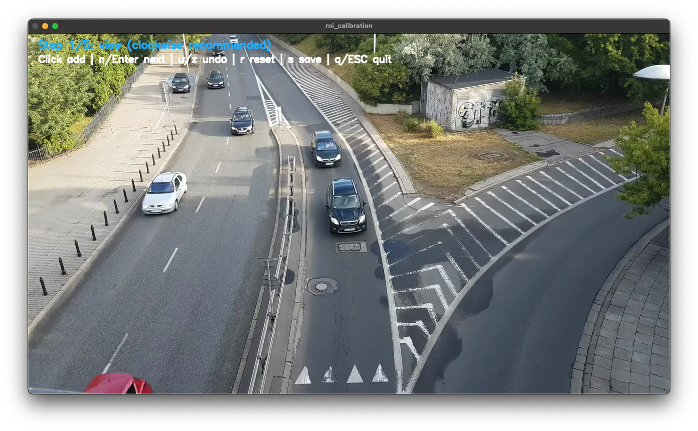
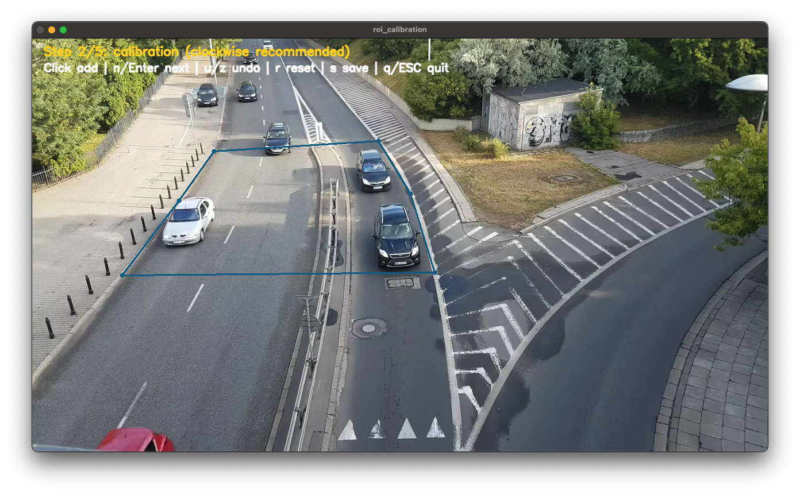
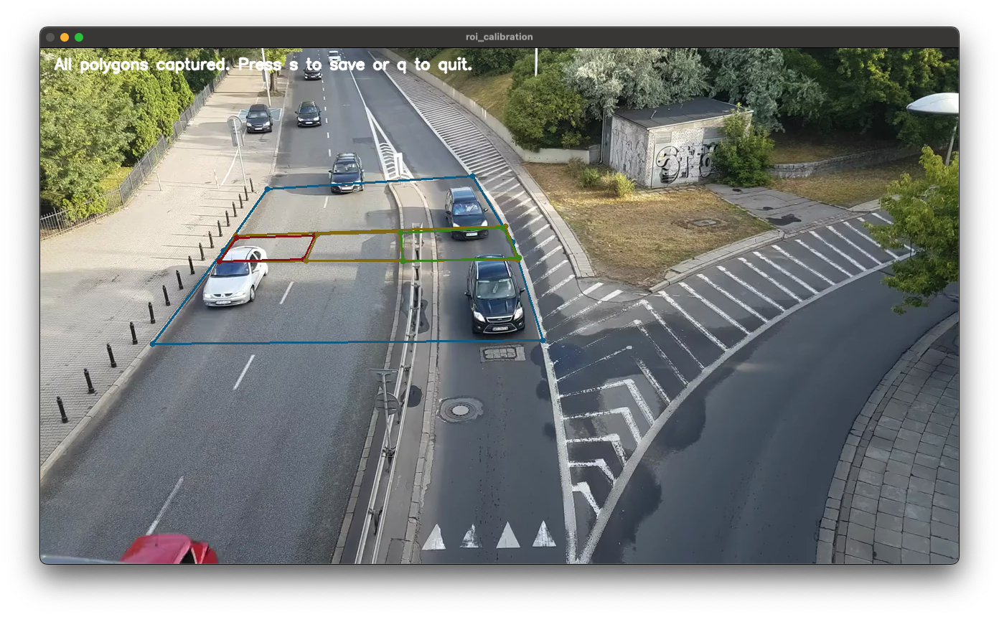

## Vehicle Speed Estimation

[](https://github.com/swhan0329/vehicle_speed_estimation/actions/workflows/ci.yml)
[](LICENSE)

A modular OpenCV baseline for per-lane vehicle speed estimation from fixed monocular CCTV footage.

### Demo
[](https://www.youtube.com/shorts/AEd7tev39Ns)
Click the GIF to open the YouTube Short.

### 30-second Quickstart
```bash
pip install -r requirements.txt
python main.py path/to/video.mp4 --output out.mp4 --show
```
If this runs, move to calibration for your own camera scene.

### What you get
- ROI polygons + lane scale calibration
- Lucas-Kanade optical flow tracking baseline
- Per-lane speed estimation + overlay video export

### Applications
- Traffic monitoring
- ITS research
- Computer vision education

### Apply to your CCTV
1. Calibrate ROI polygons.
   ```bash
   python -m app.calibrate.roi --video path/to/video.mp4 --lanes 5 --output config/camera.yaml
   ```
2. Set lane `px_to_meter` using measured real-world distance.
   ```bash
   python -m app.calibrate.scale --config config/camera.yaml --lane 1 --meters 3.5 --interactive --video path/to/video.mp4
   ```
3. Run with calibrated config.
   ```bash
   python main.py path/to/video.mp4 --config config/camera.yaml --output output.mp4 --show
   ```

### Calibration Snapshot
View polygon (detectable area):


Calibration area (scale reference area):


Lane polygons (lane assignment zones):


### `px_to_meter` Setup (Important)
`px_to_meter` changes by road geometry and camera angle, so recalibration is required per camera/scene.

Recommended real-world references:
- lane width (for example `3.5m`)
- stop-line or road marking interval
- known vehicle body length/width (approximate)

Optional runtime override without editing YAML:
```bash
python main.py path/to/video.mp4 --config config/camera.yaml --px-to-meter 0.0895,0.088,0.0774
```

Single value applies to all lanes:
```bash
python main.py path/to/video.mp4 --config config/camera.yaml --px-to-meter 0.082
```

### Validation examples
If YAML is wrong, loader returns explicit errors. Common examples:
- `polygons.view must contain at least 3 points`
- `lanes must be a non-empty list`
- `lanes[0].px_to_meter must be > 0`

### Key input notes (OpenCV windows)
- macOS: use single keys (`u/z/n/r/s`, `Enter`, `ESC`) instead of modifier combos.
- Windows/Linux: make sure the OpenCV window is focused before typing shortcuts.

### Docs
- [Quickstart](docs/01_quickstart.md)
- [Calibration Guide](docs/02_calibration.md)
- [Common Failure Modes](docs/03_common_failure_modes.md)

### Examples
- [Run webcam](examples/run_webcam.md)
- [Run video](examples/run_video.md)
- [Calibrate a new camera](examples/calibrate_new_camera.md)

### Running Tests
```bash
python -m unittest discover -s tests
```

### Contributing
Contributions are welcome. Please see [CONTRIBUTING.md](CONTRIBUTING.md).

### Citation
If you use this project in research or education, see [CITATION.cff](CITATION.cff).

### License
This project is licensed under Apache License 2.0. See [LICENSE](LICENSE).

## Star History
[](https://star-history.com/#swhan0329/vehicle_speed_estimation&Date)
