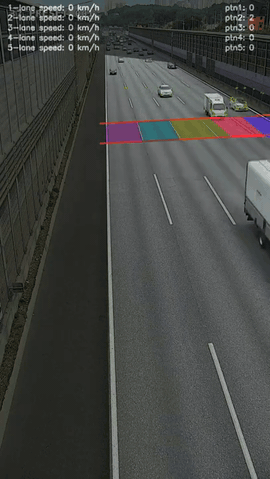
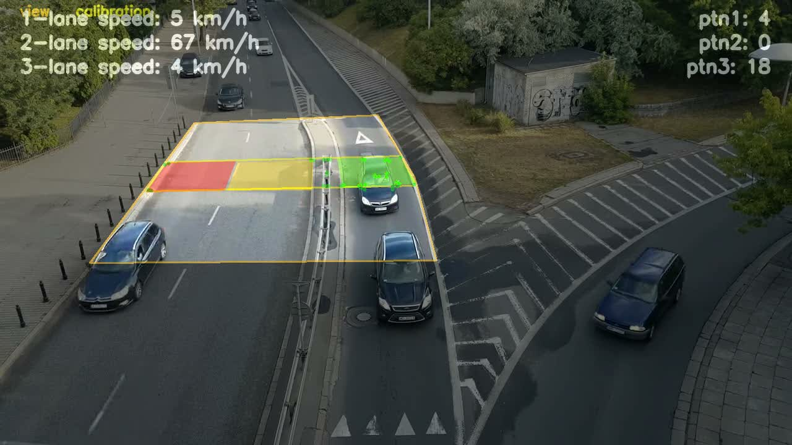

## Vehicle Speed Estimation

### Overview
This project estimates vehicle speed from fixed monocular CCTV footage using the Lucas-Kanade optical flow tracker.
It is designed as a beginner-friendly reference implementation that can be reused across cameras through ROI and scale calibration.

### Applications
- Traffic monitoring
- ITS (Intelligent Transportation Systems) research
- Computer vision education

### Demo
[](https://www.youtube.com/shorts/AEd7tev39Ns)

Click the GIF to watch the full YouTube Shorts demo.

### Calibration Snapshot


Overlay legend:
- Orange boundary: `view` polygon
- Yellow boundary: `calibration` polygon
- Colored filled blocks: lane polygons
- Green dots/lines: tracked feature points

### Quickstart
1. Clone and install dependencies.
   ```bash
   git clone https://github.com/swhan0329/vehicle_speed_estimation.git
   cd vehicle_speed_estimation
   pip install -r requirements.txt
   ```
2. Run with default calibration.
   ```bash
   python main.py sample_video.mp4 --output output.mp4 --show
   ```
3. Use a custom config for your camera.
   ```bash
   python main.py sample_video.mp4 --config config/camera.yaml --output output.mp4 --show
   ```

### Calibration Workflow
1. Collect polygons (view, calibration area, lane polygons).
   ```bash
   python -m app.calibrate.roi --video sample_video.mp4 --lanes 5 --output config/camera.yaml
   ```
2. Set lane scale (`px_to_meter`) with known real-world distance.
   ```bash
   python -m app.calibrate.scale --config config/camera.yaml --lane 1 --meters 3.5 --point1 100 220 --point2 240 220
   ```
3. Run pipeline with calibrated config.
   ```bash
   python main.py sample_video.mp4 --config config/camera.yaml --output output.mp4 --show
   ```

Point order recommendation: click points clockwise for every polygon.  
Mac shortcut note: OpenCV windows are most reliable with single keys (`u/z/n/r/s`, `Enter`, `ESC`).

### Project Structure
- `main.py`: CLI entrypoint.
- `app/pipeline.py`: frame loop orchestration.
- `app/io/`: video source handling.
- `app/detect/`: feature detection module.
- `app/track/`: Lucas-Kanade tracker state/update.
- `app/speed/`: lane assignment, speed estimation, smoothing.
- `app/viz/`: overlays and debug rendering.
- `app/calibrate/`: ROI/scale calibration CLIs.
- `config/default.yaml`: default polygons, lane scales, runtime params.
- `config/loader.py`: YAML load/validation/merge.
- `tests/`: unit tests.

### Docs
- [Quickstart](docs/01_quickstart.md)
- [Calibration Guide](docs/02_calibration.md)
- [Common Failure Modes](docs/03_common_failure_modes.md)

### Notes
- Works best with fixed camera road scenes.
- You must recalibrate ROI polygons and lane scale values per camera view.
- Performance and accuracy can degrade with severe camera shake, heavy occlusion, or low frame rate footage.

### Running Tests
```bash
python -m unittest discover -s tests
```

### Contributing
Contributions are welcome.

- For bug fixes, docs, calibration UX, and performance improvements, please open a PR.
- See [CONTRIBUTING.md](CONTRIBUTING.md) for contribution guidelines.

### License
This project is licensed under the Apache License 2.0.  
See [LICENSE](LICENSE) for details.

## Star History
[](https://star-history.com/#swhan0329/vehicle_speed_estimation&Date)
